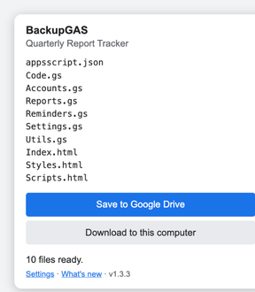
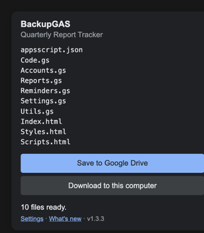

# BackupGAS

A Chrome extension that saves every file of a Google Apps Script project — to Google Drive or to your computer — straight from the script editor.

It works for **container-bound scripts** (the ones attached to a Sheet, Doc, Form or Slides file), which Google offers no way to download and which the Drive API cannot see.

  
  

Open a project in the Apps Script editor, click the icon, and every file is saved with its own name — light and dark themes both supported.

## Why this exists

There are three usual ways to get Apps Script code out, and each can be blocked:

| Method | Works for bound scripts | Blocked when |
| --- | --- | --- |
| Drive download / export | No | Always — bound scripts aren't Drive files |
| Apps Script API (`clasp`, custom scripts) | Yes | Your account can't enable the API in a Google Cloud project |
| This extension | Yes | Never — it reads the editor page you already have open |

If your organization won't let you create a Cloud project, the API route ends in
`Apps Script API has not been used in project NNNN before or it is disabled`, with no way to fix it yourself. This extension avoids the API completely: the editor page already holds every file of the project, so the code is read from there.

## How it works

The Apps Script editor is a Monaco editor. Each entry in its **Project files** list carries a `data-res-id="file_N"` attribute, and the editor keeps that file's contents in a Monaco model whose URI ends in `/file_N.<ext>`. The extension injects a function into the page (`world: "MAIN"`, so it can see the page's `monaco` object), pairs each file name with its model, and reads the text. Files that haven't been opened yet are clicked once so the editor loads them.

Exports contain exactly what the editor shows, including unsaved edits.

## Install

Not on the Chrome Web Store yet. Load it unpacked:

1. Clone or download this repository.
2. Open `chrome://extensions`.
3. Turn on **Developer mode**.
4. Click **Load unpacked** and select this folder.
5. Pin the extension from the puzzle-piece menu.

## Use

1. Open a script: in a Sheet, **Extensions → Apps Script**, or open the project at script.google.com.
2. Wait for the editor to finish loading, then click the extension icon.
3. Click **Download to this computer** or **Save to Google Drive**.

Downloads go to `Downloads/Apps Script Backups/<project name> <timestamp>/`, one file per script file, with the original names (`Code.gs`, `Index.html`, `appsscript.json`).

## Optional: save to Google Drive

A Chrome extension can't write to Drive without a Google Cloud OAuth client — the same wall this project exists to avoid. Instead, the extension posts the files to a small Apps Script web app that **you** deploy, which writes them to your Drive with ordinary Drive access.

1. Open [script.new](https://script.new), paste in [`receiver/Code.gs`](receiver/Code.gs), and save.
2. **Deploy → New deployment → Web app**. Who has access: **Anyone**, or your own organization if that is all your admin allows — both work. Authorize it.
3. Open the `/exec` address it gives you. The page shows a setup line, `…/exec#password`. Copy it.
4. Paste that line into the extension's **Settings** page.

Files then land in `My Drive/Apps Script Backups/<project name>/<timestamp>/`.

### Security note

The receiver is deployed as "Anyone" because the extension posts to it without a Google sign-in, so a password guards it instead. The receiver generates that password itself and shows it once, on the first visit to its address; after that the page won't show it again. The receiver:

- rejects any request whose password doesn't match,
- only ever creates files, never reads or deletes anything,
- writes only inside `My Drive/Apps Script Backups`.

Keep the setup line private. To issue a new one, delete `TOKEN` and `TOKEN_CLAIMED` in **Project Settings → Script Properties** and reload the `/exec` page.

## Permissions

| Permission | Why |
| --- | --- |
| `scripting` | Read the file list and contents from the open editor tab |
| `downloads` | Save files to the Downloads folder |
| `storage` | Remember your receiver address and token |
| `https://script.google.com/*` | The only site the extension runs on; also where the receiver lives |
| `https://script.googleusercontent.com/*` | Where Apps Script web apps return their response |

No analytics, no servers, nothing leaves your machine except the files you send to your own receiver.

## Limitations

- Only exports the project currently open in the editor; there's no bulk export across projects.
- Standalone script projects can also be backed up without this extension, since they are ordinary Drive files.
- Relies on the editor's current page structure. If Google changes it, the extension needs an update.

## Versioning

[Semantic versioning](https://semver.org). The version in `manifest.json` is the source of truth and matches the git tag; every release is listed in [CHANGELOG.md](CHANGELOG.md). The popup footer shows the installed version and links to the changelog.

- **Patch** — fixes that don't change how it's used.
- **Minor** — new features, backwards compatible.
- **Major** — changes requiring you to redeploy the receiver or redo settings.

## License

[Apache License 2.0](LICENSE) — free to use, modify and distribute, including commercially, with an explicit patent grant. Keep the notice and state your changes.
